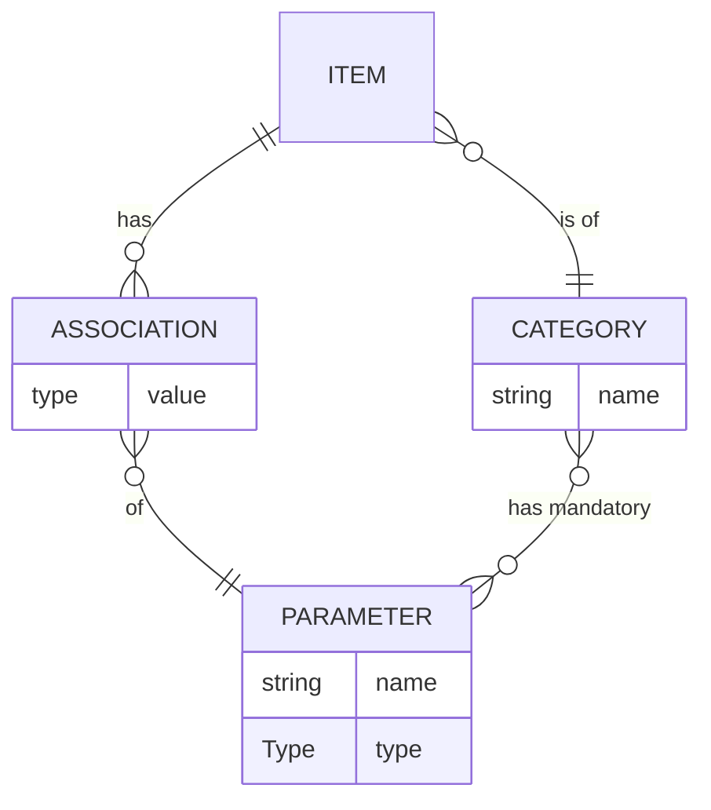

# Item comparison engine

## Conceptual model

The `type` of `value` in `ASSOCIATION` is exactly
the `type` field of the corresponding `PARAMETER`.

An `ITEM` has `ASSOCIATION`s of values for every
`PARAMETER` mandatory for the corresponding `CATEGORY`.

`Type` (of types) consists of `text`, `numeric`, `enum`.

## Specification

The input is a JSON object with an `action` key and additional members.
The output is a JSON object with a `status` key and additional members.

The additional members depend on the `action` string:

### `add_or_extend_parameter`

#### Input

* `name` – a string
* `type` – either `"text"`, `"numeric"`, or an enum (array of strings)

### `add_category`

#### Input
* `name` – a string

### `add_items`

#### Input

* `items` – list of objects with fields:
    * `category` – category name
    * `attrs` – an object where keys are parameter names and values have the corresponding type

#### Output

* `ids` – array of integers identifying the newly-added items, ordered as in `items`

### `modify_items`

#### Input

* `items` – list of objects with fields as in `add_items`, but additionally with `id` fields identifying the item to modify

### `delete_item`

#### Input

* `id` – integer identifying the item to delete

### `query_items`

#### Input

* `where` – TODO
* `aggregate` – TODO
* `group` – boolean indicating whether to group `aggregate` results by category (applicable only if `aggregate` is specified)

#### Output

* `results` – list of objects with the keys dependent on the query:
  if `aggregate` was not specified, then the fields are `id`, `category`, and `attrs` of an item;
  otherwise the keys correspond to the `aggregate` operations, and additionally there is the `category` key if `group` was selected.

